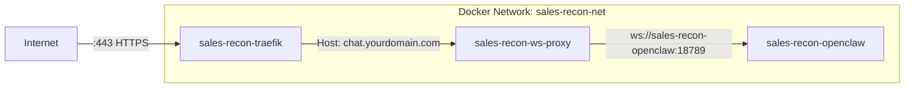

# Sales-Recon Production Deployment Report

> **Stack**: 3 Docker containers — Traefik (reverse proxy), OpenClaw (AI gateway), ws-proxy (WebSocket auth bridge)
> **Date**: February 2026

---

## 1. VPS vs Container Management Platform

### What You're Deploying

Your stack has specific properties that heavily influence platform choice:

| Property | Impact |
|---|---|
| **Custom Dockerfile** with `apt-get`, Python, Playwright, Chromium | Requires full Docker build — not a simple image pull |
| **Persistent volumes** for `.openclaw` config and workspace | Needs reliable, persistent storage |
| **Traefik** as reverse proxy with Let's Encrypt | Requires ports 80/443 bound to a public IP |
| **Inter-container networking** via Docker Compose bridge | Needs native Docker Compose support |
| **Heavy image** (~2GB+ with Chromium/Playwright) | Needs adequate RAM and disk |
| **WebSocket long-lived connections** | Platform must not aggressively kill idle connections |

### Leading Providers

#### VPS Providers
| Provider | Starting Price | Key Strength |
|---|---|---|
| **Hetzner** | €4.51/mo (CX22) | Best price/performance in EU, excellent ARM options |
| **DigitalOcean** | $6/mo (Droplet) | Best developer UX, rich ecosystem |
| **Vultr** | $6/mo | Wide global presence, good API |
| **Linode (Akamai)** | $5/mo | Stable, predictable pricing |
| **OVHcloud** | €3.50/mo | EU-based, unmetered bandwidth |
| **Contabo** | €5.49/mo | Highest RAM per dollar |

#### Container Management Platforms (PaaS)
| Provider | Starting Price | Key Strength |
|---|---|---|
| **Railway** | Usage-based (~$5/mo+) | Fastest deploy-from-GitHub, visual canvas |
| **Render** | $7/mo per service | Managed services, Heroku-like simplicity |
| **Fly.io** | Usage-based (~$5/mo+) | Global edge deployment, low latency |
| **Coolify** (self-hosted PaaS) | Free (self-host on VPS) | PaaS on your own VPS |

### ⚠️ Why PaaS Platforms Are a Poor Fit for This Stack

> [!CAUTION]
> Railway, Render, and Fly.io **do not natively support Docker Compose**. Each service must be deployed individually, and you lose Traefik's ability to bind to ports 80/443 and auto-discover containers via Docker labels.

Specific issues:

1. **No Docker Compose** — You'd need to split into 3 separate services and manually configure networking
2. **No Traefik** — PaaS platforms provide their own routing; your Traefik labels become useless
3. **No Docker socket** — PaaS platforms don't expose `/var/run/docker.sock` (security restriction)
4. **Persistent volumes** — Limited or expensive; your `.openclaw` workspace volumes need reliable persistence
5. **Long-running WebSockets** — Some platforms aggressively timeout idle connections
6. **Image size** — Your Chromium/Playwright image is 2GB+; build times and cold starts would be painful
7. **Cost** — Running 3 services on Render = $21+/mo _minimum_, vs €4.51/mo on Hetzner for more resources

---

## 2. Recommendation: Hetzner VPS

### Why Hetzner

| Factor | Hetzner Advantage |
|---|---|
| **Price** | CX22 (2 vCPU, 4GB RAM, 40GB SSD) at €4.51/mo — best value |
| **Docker Compose** | Full native support — your `docker-compose.yml` works as-is |
| **EU data centers** | Falkenstein, Nuremberg, Helsinki, Ashburn (US) |
| **You have an account** | No onboarding friction |
| **ARM option** | CAX11 (2 ARM vCPU, 4GB, 40GB) at €3.79/mo — even cheaper |
| **Hetzner Cloud API** | Automate server creation via CLI/API |
| **Firewall** | Cloud firewall at network level (free) |
| **Snapshots/Backups** | €0.012/GB/mo for snapshots; 20% addon for automated backups |

### Recommended Server Spec

| Setting | Value |
|---|---|
| **Plan** | **CX32** (3 vCPU, 8GB RAM, 80GB disk) |
| **OS** | Ubuntu 24.04 LTS |
| **Location** | Falkenstein (cheapest) or Ashburn (US users) |
| **Price** | ~€7.59/mo |

> [!IMPORTANT]
> Choose CX32 (8GB RAM) over CX22 (4GB). Your OpenClaw container with Chromium/Playwright is memory-hungry. 4GB will cause OOM kills under load.

---

## 3. Security Audit — Network Configuration

### 3.1 Issues Found in Current Config

#### 🔴 Critical: API Keys Exposed in `.env`

Your `.env` file contains **live API keys** that are committed-adjacent. While `.env*` is in `.gitignore`, verify:

```bash
# Verify .env is NOT tracked
git ls-files --error-unmatch .env 2>&1 | grep -q "not in" && echo "SAFE" || echo "DANGER"
```

#### 🔴 Critical: ACME Email is Placeholder

```yaml
# docker-compose.yml line 13 — CHANGE THIS!
- "--certificatesresolvers.myresolver.acme.email=your@email.com"
```

Let's Encrypt will reject certificate issuance with this placeholder.

#### 🟡 Warning: Port 8080 Exposed

```yaml
# docker-compose.yml line 18
- "8080:8080" # Temporary for direct access
```

Port 8080 is the Traefik dashboard port. Even though `api.insecure=false`, **the port binding itself is an attack surface**. Remove it in production.

#### 🟡 Warning: `OPENCLAW_GATEWAY_AUTO_APPROVE=true`

```yaml
# docker-compose.yml line 37
OPENCLAW_GATEWAY_AUTO_APPROVE: "true"
```

This auto-approves all tool executions without user confirmation. Consider if this is appropriate for production.

#### 🟡 Warning: ws-proxy Loads Full `.env` via `env_file`

```yaml
# docker-compose.yml line 66-67
env_file:
  - .env
```

The ws-proxy container receives ALL environment variables including API keys it doesn't need (`XAI_API_KEY`, `GEMINI_API_KEY`, etc.). Only pass what it needs.

### 3.2 Hardened `docker-compose.yml` Recommendations

```diff
 services:
   sales-recon-traefik:
     ...
     ports:
       - "80:80"
       - "443:443"
-      - "8080:8080"  # REMOVE in production
     command:
       ...
-      - "--certificatesresolvers.myresolver.acme.email=your@email.com"
+      - "--certificatesresolvers.myresolver.acme.email=your-real@email.com"
+      # Add HTTP→HTTPS redirect
+      - "--entrypoints.web.http.redirections.entrypoint.to=websecure"
+      - "--entrypoints.web.http.redirections.entrypoint.scheme=https"

   ws-proxy:
-    env_file:
-      - .env
     environment:
       OPENCLAW_URL: "ws://sales-recon-openclaw:18789"
       OPENCLAW_TOKEN: "${OPENCLAW_GATEWAY_TOKEN}"
       CLERK_PUBLISHABLE_KEY: "${NEXT_PUBLIC_CLERK_PUBLISHABLE_KEY}"
+      CLERK_SECRET_KEY: "${CLERK_SECRET_KEY}"
```

### 3.3 Hetzner Cloud Firewall Rules

Create a cloud-level firewall (applied before the OS) with these rules:

| Direction | Protocol | Port | Source | Action |
|---|---|---|---|---|
| Inbound | TCP | 22 | Your IP only | Allow |
| Inbound | TCP | 80 | 0.0.0.0/0 | Allow |
| Inbound | TCP | 443 | 0.0.0.0/0 | Allow |
| Inbound | * | * | * | **Drop** |
| Outbound | * | * | * | Allow |

Also run on the server:
```bash
# Install and configure UFW as a second layer
sudo ufw default deny incoming
sudo ufw default allow outgoing
sudo ufw allow 22/tcp    # SSH (restrict to your IP if static)
sudo ufw allow 80/tcp    # HTTP (for ACME challenges)
sudo ufw allow 443/tcp   # HTTPS
sudo ufw enable
```

---

## 4. Pre-Production Validation Checklist

### What You Can Test Before Going Live

```bash
# 1. Validate docker-compose syntax
docker compose config

# 2. Build images and check for errors
docker compose build --no-cache

# 3. Start stack and check all containers are running
docker compose up -d
docker compose ps  # All should show "Up"

# 4. Test inter-container DNS resolution
docker exec sales-recon-ws-proxy ping -c 1 sales-recon-openclaw
docker exec sales-recon-ws-proxy nping --tcp -p 18789 sales-recon-openclaw

# 5. Check ws-proxy can reach OpenClaw WebSocket
docker exec sales-recon-ws-proxy node -e "
  const ws = new (require('ws'))('ws://sales-recon-openclaw:18789');
  ws.on('open', () => { console.log('CONNECTED'); ws.close(); process.exit(0); });
  ws.on('error', (e) => { console.error('FAILED:', e.message); process.exit(1); });
"

# 6. Test Traefik routing locally
curl -H "Host: localhost" http://localhost:80

# 7. Check Traefik can see your services
docker exec sales-recon-traefik wget -qO- http://localhost:8080/api/http/routers 2>/dev/null || \
  echo "Dashboard disabled (expected in production)"

# 8. Verify Let's Encrypt (only works with real domain pointed to server)
# Check acme.json is being populated
docker exec sales-recon-traefik cat /letsencrypt/acme.json | head -20

# 9. Check container resource usage
docker stats --no-stream
```

---

## 5. Traefik Configuration Audit

### Current Labels Analysis

#### OpenClaw Gateway (`sales-recon-openclaw`)
```yaml
labels:
  - "traefik.enable=true"
  - "traefik.http.routers.gateway.rule=Host(`gateway.localhost`)"    # ⚠️ localhost only
  - "traefik.http.routers.gateway.entrypoints=web"                   # ⚠️ HTTP only, no TLS
  - "traefik.http.services.gateway.loadbalancer.server.port=18789"   # ✅ Correct
```

> [!WARNING]
> The OpenClaw gateway should **NOT** be publicly accessible. The ws-proxy is the public entrypoint. In production, **remove Traefik labels from the OpenClaw container entirely**. The ws-proxy connects directly via the Docker network (`ws://sales-recon-openclaw:18789`).

#### ws-proxy (`sales-recon-ws-proxy`)
```yaml
labels:
  - "traefik.enable=true"
  # Production rules (currently commented out) — ENABLE THESE
  # - "traefik.http.routers.wsproxy-prod.rule=Host(`chat.yourdomain.com`)"
  # - "traefik.http.routers.wsproxy-prod.entrypoints=websecure"
  # - "traefik.http.routers.wsproxy-prod.tls.certresolver=myresolver"

  # Local rules — DISABLE THESE in production
  - "traefik.http.routers.wsproxy-local.rule=Host(`localhost`)"
  - "traefik.http.routers.wsproxy-local.entrypoints=web"

  - "traefik.http.services.wsproxy.loadbalancer.server.port=8080"    # ✅ Correct
```

### Production-Ready Traefik Labels

```yaml
# sales-recon-openclaw — REMOVE all traefik labels
# This service should NOT be publicly routable

# ws-proxy — Production labels
labels:
  - "traefik.enable=true"
  - "traefik.http.routers.wsproxy.rule=Host(`chat.yourdomain.com`)"
  - "traefik.http.routers.wsproxy.entrypoints=websecure"
  - "traefik.http.routers.wsproxy.tls.certresolver=myresolver"
  - "traefik.http.services.wsproxy.loadbalancer.server.port=8080"
  # WebSocket headers (important for proper WS proxying)
  - "traefik.http.middlewares.ws-headers.headers.customrequestheaders.X-Forwarded-Proto=https"
  - "traefik.http.routers.wsproxy.middlewares=ws-headers"
```

### Missing: ws-proxy Not in the Docker Network

> [!CAUTION]
> Your ws-proxy service is **missing the `networks` directive** in the production labels section. It IS present at line 90-91, but double-check the alignment — it must be inside the `ws-proxy` service block, not after `depends_on`.

Confirmed: Lines 90-91 show `networks: - sales-recon-net` √ — this is correct.

---

## 6. Inter-Container Communication in Production

All three containers are on the `sales-recon-net` bridge network, so they can communicate by container name:



**This will work identically in production.** Docker Compose creates the bridge network and configures DNS automatically. The container names (`sales-recon-openclaw`, `sales-recon-ws-proxy`) resolve to internal IPs within the network.

### Verify in Production

```bash
# Confirm all containers are on the same network
docker network inspect sales-recon-net | jq '.[0].Containers'

# Test DNS resolution from ws-proxy to openclaw
docker exec sales-recon-ws-proxy getent hosts sales-recon-openclaw
```

---

## 7. Accessing Containers and Logs

### Viewing Logs

```bash
# All containers (follow mode)
docker compose logs -f

# Specific container
docker compose logs -f sales-recon-openclaw
docker compose logs -f sales-recon-ws-proxy
docker compose logs -f sales-recon-traefik

# Last 100 lines
docker compose logs --tail=100 sales-recon-openclaw

# Since a specific time
docker compose logs --since="2026-02-16T09:00:00" sales-recon-openclaw
```

### Interactive Shell Access

```bash
# Shell into OpenClaw container
docker exec -it sales-recon-openclaw bash

# Shell into ws-proxy (Alpine — use sh)
docker exec -it sales-recon-ws-proxy sh

# Shell into Traefik
docker exec -it sales-recon-traefik sh
```

### Remote Access (via SSH)

```bash
# From your local machine
ssh root@your-server-ip "docker compose -f /path/to/docker-compose.yml logs -f"

# Or SSH in and then run commands
ssh root@your-server-ip
cd /opt/sales-recon
docker compose logs -f
```

---

## 8. Remote OpenClaw & MCPorter Commands

### Running OpenClaw Commands Remotely

```bash
# Health check
docker exec sales-recon-openclaw node dist/index.js health --token "$OPENCLAW_GATEWAY_TOKEN"

# Run any OpenClaw CLI command
docker exec -it sales-recon-openclaw node dist/index.js <command> [args]

# Examples:
docker exec -it sales-recon-openclaw node dist/index.js agents list
docker exec -it sales-recon-openclaw node dist/index.js channels list
docker exec -it sales-recon-openclaw node dist/index.js config get
```

### Running MCPorter Commands Remotely

```bash
# List configured MCP servers
docker exec -it sales-recon-openclaw npx mcporter config list

# Add a new MCP server
docker exec -it sales-recon-openclaw npx mcporter config add <name> \
  --transport http \
  --url "https://example.com/mcp"

# Remove an MCP server
docker exec -it sales-recon-openclaw npx mcporter config remove <name>

# Check mcporter status
docker exec -it sales-recon-openclaw npx mcporter status
```

### From Your Local Machine (One-Liner via SSH)

```bash
ssh root@your-server "docker exec sales-recon-openclaw node dist/index.js health --token '<token>'"
ssh root@your-server "docker exec sales-recon-openclaw npx mcporter config list"
```

---

## 9. Updating the Deployment

### Standard Update Process

```bash
# On the server
cd /opt/sales-recon

# 1. Pull latest code
git pull origin main

# 2. Rebuild images (only rebuilds changed layers)
docker compose build

# 3. Recreate containers with new images (zero-downtime for stateless services)
docker compose up -d

# 4. Verify
docker compose ps
docker compose logs --tail=50
```

### Rolling Update (Minimize Downtime)

```bash
# Rebuild and restart only specific services
docker compose build sales-recon-openclaw
docker compose up -d --no-deps sales-recon-openclaw

# Same for ws-proxy
docker compose build ws-proxy
docker compose up -d --no-deps ws-proxy
```

### Update Base OpenClaw Image

```bash
# Pull latest OpenClaw image, then rebuild
docker pull ghcr.io/openclaw/openclaw:latest
docker compose build --no-cache sales-recon-openclaw
docker compose up -d sales-recon-openclaw
```

---

## 10. Archiving the OpenClaw Workspace

To recreate your exact OpenClaw environment, archive these items:

### What to Archive

| Item | Path (on server) | Purpose |
|---|---|---|
| OpenClaw config | `~/.openclaw/openclaw.json` | Agent configs, model settings, gateway auth |
| MCPorter config | `~/.openclaw/mcporter.json` | MCP server registrations |
| Workspace data | `~/.openclaw/workspace/` | Agent workspace files, memory, session data |
| Golden configs (repo) | `openclaw-golden-image.json`, `mcporter-golden-image.json` | Reproducible config templates |
| Environment variables | `.env` | All API keys and tokens |

### Archive Script

```bash
#!/bin/bash
# archive-openclaw.sh — Run on the production server
set -e

TIMESTAMP=$(date +%Y%m%d_%H%M%S)
ARCHIVE_NAME="openclaw-backup-${TIMESTAMP}.tar.gz"
OPENCLAW_DIR="${OPENCLAW_CONFIG_DIR:-$HOME/.openclaw}"

echo "Archiving OpenClaw workspace..."

tar -czf "$ARCHIVE_NAME" \
  -C "$(dirname "$OPENCLAW_DIR")" "$(basename "$OPENCLAW_DIR")" \
  --exclude='*/node_modules' \
  --exclude='*/.cache' \
  --exclude='*/tmp'

echo "Archive created: $ARCHIVE_NAME ($(du -h "$ARCHIVE_NAME" | cut -f1))"

# Download to local machine:
# scp root@your-server:/opt/sales-recon/$ARCHIVE_NAME ./backups/
```

### Restore from Archive

```bash
# On new server
tar -xzf openclaw-backup-*.tar.gz -C $HOME/

# Then start the stack
docker compose up -d
```

### Alternative: Use Golden Image Configs

Your `openclaw-golden-image.json` and `mcporter-golden-image.json` are already excellent reproducibility artifacts. To restore from scratch:

```bash
# Copy golden configs into the openclaw config dir
cp openclaw-golden-image.json ~/.openclaw/openclaw.json
cp mcporter-golden-image.json ~/.openclaw/mcporter.json

# Start the stack — entrypoint script will configure MCP servers
docker compose up -d
```

---

## 11. Things That WILL Be Problems

### 🔴 Problem 1: Memory Pressure (OOM Kills)

Your OpenClaw container runs Chromium via Playwright. Each Crawl4AI scraping job can consume 500MB+ of RAM. With 4GB server RAM, you'll hit OOM kills.

**Solution**: Use 8GB RAM server (CX32) and add memory limits:
```yaml
services:
  sales-recon-openclaw:
    deploy:
      resources:
        limits:
          memory: 6G
```

### 🔴 Problem 2: Disk Space Exhaustion

Docker images, build cache, and logs will fill your disk.

**Solution**:
```bash
# Add to crontab
0 3 * * * docker system prune -f --volumes 2>&1 | logger -t docker-prune
0 4 * * 0 docker builder prune -f 2>&1 | logger -t docker-builder-prune

# Set log rotation in docker-compose.yml
services:
  sales-recon-openclaw:
    logging:
      driver: json-file
      options:
        max-size: "10m"
        max-file: "3"
```

### 🟡 Problem 3: Let's Encrypt Rate Limits

Let's Encrypt has rate limits (50 certificates/week per domain). During testing, use the staging server:
```yaml
- "--certificatesresolvers.myresolver.acme.caserver=https://acme-staging-v02.api.letsencrypt.org/directory"
```
Remove this line for production.

### 🟡 Problem 4: DNS Propagation Delay

After pointing your domain to the Hetzner IP, DNS propagation can take up to 48 hours. Traefik won't get a certificate until the domain resolves to your server.

**Solution**: Set a low TTL (300s) on your DNS record before switching.

### 🟡 Problem 5: Docker Socket Security

You're mounting `/var/run/docker.sock` into Traefik (read-only, which is good): this gives Traefik the ability to inspect all containers. In a compromise, an attacker could enumerate your infrastructure.

**Solution**: This is acceptable for single-tenant setups. For higher security, use [Traefik's Docker socket proxy](https://github.com/Tecnativa/docker-socket-proxy).

### 🟡 Problem 6: `.env` Secrets on Server

Your `.env` contains API keys in plaintext on disk. If the server is compromised, all keys are exposed.

**Solution**:
```bash
# Restrict file permissions
chmod 600 .env

# Consider Docker secrets for production (more complex but more secure)
# Or use Hetzner Cloud Secrets Manager
```

### 🟡 Problem 7: No Monitoring or Alerting

You won't know if containers crash unless you check logs manually.

**Solution**: Add a lightweight monitoring stack:
```bash
# Simple uptime check with a free service
# Option 1: UptimeRobot (free, monitors HTTPS endpoint)
# Option 2: Add healthchecks to docker-compose.yml
```

```yaml
services:
  sales-recon-openclaw:
    healthcheck:
      test: ["CMD", "node", "dist/index.js", "health", "--token", "${OPENCLAW_GATEWAY_TOKEN}"]
      interval: 30s
      timeout: 10s
      retries: 3
      start_period: 30s
```

### 🟡 Problem 8: SSH Key Security

**Never** use password authentication for SSH on a public server.

```bash
# On server setup
sed -i 's/#PasswordAuthentication yes/PasswordAuthentication no/' /etc/ssh/sshd_config
sed -i 's/PermitRootLogin yes/PermitRootLogin prohibit-password/' /etc/ssh/sshd_config
systemctl restart sshd
```

### 🟢 Problem 9: ws-proxy Device Identity Persistence

Your ws-proxy stores `device.identity.json` in `./ws-proxy/data/`. This volume mount is already configured correctly in docker-compose.yml. If you lose this file, the ws-proxy will generate a new device ID and the gateway will reject it with a "device identity mismatch" error.

**Solution**: Include `ws-proxy/data/` in your backup strategy (but NOT in git — already in `.gitignore` ✅).

---

## 12. Production Deployment Playbook (Step-by-Step)

### Initial Server Setup

```bash
# 1. Create Hetzner CX32 server with Ubuntu 24.04
# 2. SSH in
ssh root@<server-ip>

# 3. Update and install Docker
apt update && apt upgrade -y
curl -fsSL https://get.docker.com | sh
systemctl enable docker

# 4. Create non-root user (optional but recommended)
adduser deploy
usermod -aG docker deploy

# 5. Clone your repo
git clone <your-repo-url> /opt/sales-recon
cd /opt/sales-recon

# 6. Create production .env
cp .env.example .env  # Or scp your local .env
chmod 600 .env
nano .env  # Set all production values

# 7. Update docker-compose.yml for production
# - Remove port 8080
# - Set real ACME email
# - Enable HTTPS redirect
# - Uncomment production Traefik labels for ws-proxy
# - Remove Traefik labels from OpenClaw
# - Remove env_file from ws-proxy

# 8. Point your domain DNS to server IP
# chat.yourdomain.com → <server-ip>

# 9. Build and start
docker compose build
docker compose up -d

# 10. Verify
docker compose ps
docker compose logs -f
curl -v https://chat.yourdomain.com
```

### Configure Hetzner Firewall

1. Go to **Hetzner Cloud Console** → **Firewalls** → **Create Firewall**
2. Add rules: SSH (22), HTTP (80), HTTPS (443) — inbound only
3. Apply the firewall to your server

---

> [!TIP]
> **Quick Reference** — Essential day-to-day commands on your production server:
> ```bash
> cd /opt/sales-recon
> docker compose ps                    # Check status
> docker compose logs -f               # Follow all logs
> docker compose restart               # Restart all
> docker exec -it sales-recon-openclaw bash  # Shell into OpenClaw
> docker compose down && docker compose up -d  # Full restart
> ```

---

## 13. Multi-App VPS Strategy: The "Global" Reverse Proxy

### Is Traefik the Best Choice?

Yes, **Traefik is the absolute best choice** for hosting multiple Docker containers or projects on a single Hetzner VPS. 

- **Traefik (Current & Recommended)**: Built specifically for Docker. You spin up a new app, add Traefik labels in its `docker-compose.yml`, and Traefik auto-discovers it. Zero config files, zero downtime.
- **Nginx Proxy Manager**: Good if you prefer a point-and-click GUI to manage domains and SSL. However, it requires a manual setup step in the UI for every new container you deploy, whereas Traefik is declarative "infrastructure as code."
- **Coolify**: A self-hosted PaaS (Platform as a Service) that runs on your VPS. It uses Traefik/Caddy under the hood and manages the *entire* deployment lifecycle (from git push to build). If you want an experience like Vercel or Railway but on your own server, use Coolify. But if you want to retain lower-level control via `docker-compose` networks, stick to raw Traefik.

### The Strategy: A Global Traefik Network

Instead of putting Traefik *inside* the `sales-recon` project stack, you run **one global Traefik instance** that serves every project on the server.

#### 1. Create an External Docker Network
This network allows Traefik to talk to all your different project containers.
```bash
docker network create webproxy
```

#### 2. The Global Traefik Stack
Create a new folder specifically for Traefik (e.g., `/opt/traefik/`), and spin it up independently.
```yaml
# /opt/traefik/docker-compose.yml
services:
  traefik:
    image: traefik:latest
    container_name: global-traefik
    restart: unless-stopped
    ports:
      - "80:80"
      - "443:443"
    command:
      - "--api.insecure=false"
      - "--providers.docker=true"
      - "--providers.docker.exposedbydefault=false"
      - "--providers.docker.network=webproxy" # Tell Traefik to look at this network
      - "--entrypoints.web.address=:80"
      - "--entrypoints.web.http.redirections.entrypoint.to=websecure"
      - "--entrypoints.web.http.redirections.entrypoint.scheme=https"
      - "--entrypoints.websecure.address=:443"
      - "--certificatesresolvers.myresolver.acme.tlschallenge=true"
      - "--certificatesresolvers.myresolver.acme.email=eusholli@gmail.com"
      - "--certificatesresolvers.myresolver.acme.storage=/letsencrypt/acme.json"
    volumes:
      - "/var/run/docker.sock:/var/run/docker.sock:ro"
      - "./letsencrypt:/letsencrypt"
    networks:
      - webproxy

networks:
  webproxy:
    external: true
```

#### 3. Update Individual Apps (e.g., `sales-recon`)
Now, remove the Traefik container from your `sales-recon` stack. Instead, just attach the entrypoint container (`ws-proxy`) to the `webproxy` network.

```yaml
# /opt/sales-recon/docker-compose.yml
services:
  # (sales-recon-openclaw remains on internal sales-recon-net)
  
  ws-proxy:
    ...
    labels:
      - "traefik.enable=true"
      - "traefik.docker.network=webproxy" # Explicitly tell Traefik which network to use
      - "traefik.http.routers.wsproxy.rule=Host(`chat.yourdomain.com`)"
      - "traefik.http.routers.wsproxy.entrypoints=websecure"
      - "traefik.http.routers.wsproxy.tls.certresolver=myresolver"
      - "traefik.http.services.wsproxy.loadbalancer.server.port=8080"
    networks:
      - sales-recon-net # For talking to openclaw
      - webproxy        # For talking to Traefik

networks:
  sales-recon-net:
    driver: bridge
  webproxy:
    external: true
```

### Managing Local vs. Production Environments

To share the exact same configuration files between your local testing and your production VPS, use **Docker Compose Overrides** or **Environment Variables**. 

**The Best Approach: Override Files**

1. **`docker-compose.yml` (Base)**  
   Contains your base setup, environment variables, dependencies, and internal networks. No Traefik routing/domain labels.
   
2. **`docker-compose.override.yml` (Local Only - do not commit to git)**  
   Contains local networking overrides. Docker Compose automatically merges this file when you run `docker compose up`.

3. **`docker-compose.prod.yml` (Production Only)**  
   Contains your production labels (TLS, Domains, public network hooks).

### The Global Proxy Workflow

Now that Traefik is separated from `sales-recon`, you must manage them as two distinct projects.

#### Initial Server Setup (Do this once per VPS)

1. Create the shared external network:
   ```bash
   docker network create webproxy
   ```
2. Start the global proxy:
   ```bash
   cd /path/to/traefik-global
   docker compose up -d
   ```

*(The global proxy will run continuously in the background. You rarely need to touch this again.)*

#### Developing Locally

When developing on your Mac, you don't need the global Traefik proxy running (unless you want to test routing rules specifically).

Because `docker-compose.override.yml` is present locally, Docker will automatically merge it.

```bash
cd ~/dev/sales-recon

# Start the local environment (uses docker-compose.yml + docker-compose.override.yml)
docker compose up -d

# Access your app via http://localhost:8080 or http://localhost (if local Traefik routing is enabled)
```

#### Deploying App to Production

When you clone your repository to the Hetzner server, `docker-compose.override.yml` will NOT be there (because it's gitignored). You only use `docker-compose.yml` and `docker-compose.prod.yml`.

```bash
cd /opt/sales-recon

# Pull latest code
git pull origin main

# Start the production environment (explicitly merge the prod override)
docker compose -f docker-compose.yml -f docker-compose.prod.yml up -d --build

# The Global Traefik instance will auto-detect the new container and instantly route chat.yourdomain.com to it!
```

**Adding a Second App:**
When you inevitably build a second app, simply create its `docker-compose.prod.yml`, attach it to the `webproxy` network, and run `docker compose up -d`. The Global Traefik instance will instantly route traffic to your second domain without needing to be restarted!

---

## 14. Testing the Deployment Config

Before releasing a full production payload, it is highly recommended to validate your config at three stages: testing the configuration locally, testing the global proxy with a dummy site on the production VPS, and finally verifying the production configuration for your app.

### 14.1. Checking the Config Locally

Before you even push your code to your server, you should verify that Docker Compose can successfully parse and build your local architecture.

1. **Verify the Merged Config:**
   Run the following command in your local `sales-recon` directory:
   ```bash
   # This will output the result of merging docker-compose.yml and docker-compose.override.yml
   docker compose config
   ```
   *Look for the `ws-proxy` labels to ensure local routing (`Host(localhost)`) is applied.*

2. **Test the Local Build:**
   ```bash
   docker compose build --no-cache
   docker compose up -d
   ```
   Check that `localhost` or `localhost:8080` correctly serves the local version of `sales-recon`.

### 14.2. Testing the Global Proxy on Production (Dummy Container)

Once you've set up the Global Traefik proxy on your VPS (`/opt/traefik/docker-compose.yml`), you should test that it correctly routes traffic and acquires SSL certificates *before* deploying your complex `sales-recon` app.

We can achieve this by deploying a simple, lightweight Nginx web server listening on port 80.

1. **SSH into your Hetzner VPS.**
2. **Create a temporary directory for the test app:**
   ```bash
   mkdir -p /opt/test-site
   cd /opt/test-site
   ```
3. **Create a `docker-compose.yml` file for the test site:**
   ```yaml
   # /opt/test-site/docker-compose.yml
   services:
     web:
       image: nginx:alpine
       container_name: test-site
       labels:
         - "traefik.enable=true"
         - "traefik.docker.network=webproxy"
         # Replace with a real subdomain you've pointed to your VPS IP
         - "traefik.http.routers.test-site.rule=Host(`test.yourdomain.com`)"
         - "traefik.http.routers.test-site.entrypoints=websecure"
         - "traefik.http.routers.test-site.tls.certresolver=myresolver"
       networks:
         - webproxy

   networks:
     webproxy:
       external: true
   ```
4. **Deploy the Test Site:**
   ```bash
   docker compose up -d
   ```
5. **Verify the Routing:**
   - Wait ~30 seconds for Let's Encrypt to provision the SSL certificate.
   - Open your browser to `https://test.yourdomain.com` (using your real subdomain).
   - If you see the "Welcome to nginx!" screen with a valid lock icon (SSL), **your Global Traefik proxy is working perfectly.**
6. **Tear down the Test Site:**
   ```bash
   docker compose down
   cd ..
   rm -rf /opt/test-site
   ```

### 14.3. Checking the Config on Production

Once you know Traefik is working perfectly, you can confidently deploy `sales-recon`. Before spinning it up, verify that the production configuration merges correctly.

1. **Pull your code on the server:**
   ```bash
   cd /opt/sales-recon
   git pull origin main
   ```

2. **Validate the Production Merge:**
   Run `docker compose config` explicitly passing the production override file:
   ```bash
   docker compose -f docker-compose.yml -f docker-compose.prod.yml config
   ```
   *Scan the output to ensure `chat.yourdomain.com`, `websecure`, and the websocket middlewares are attached to `ws-proxy`.*

3. **Deploy the App:**
   If the config looks correct, spin up the stack:
   ```bash
   docker compose -f docker-compose.yml -f docker-compose.prod.yml up -d --build
   ```
   Watch the logs to confirm the app boots successfully:
   ```bash
   docker compose logs -f
   ```
